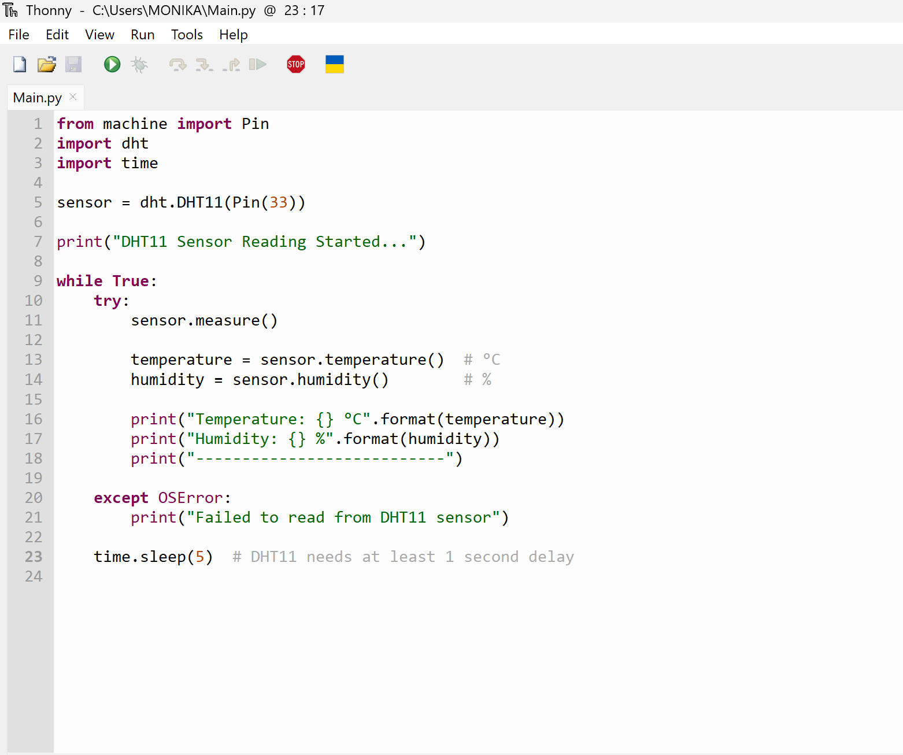
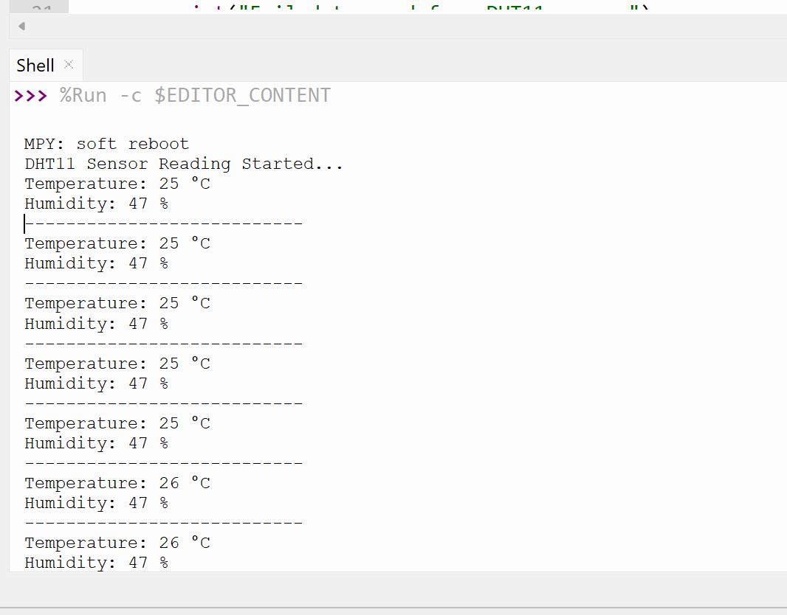
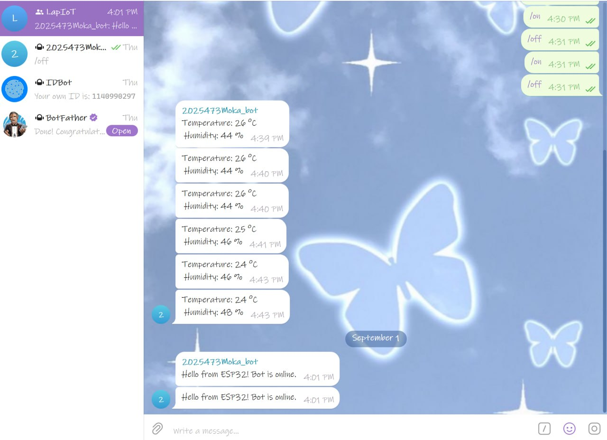
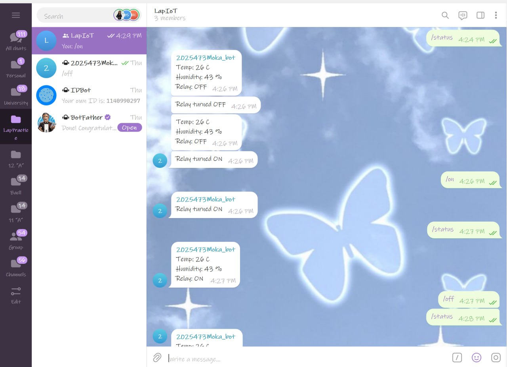
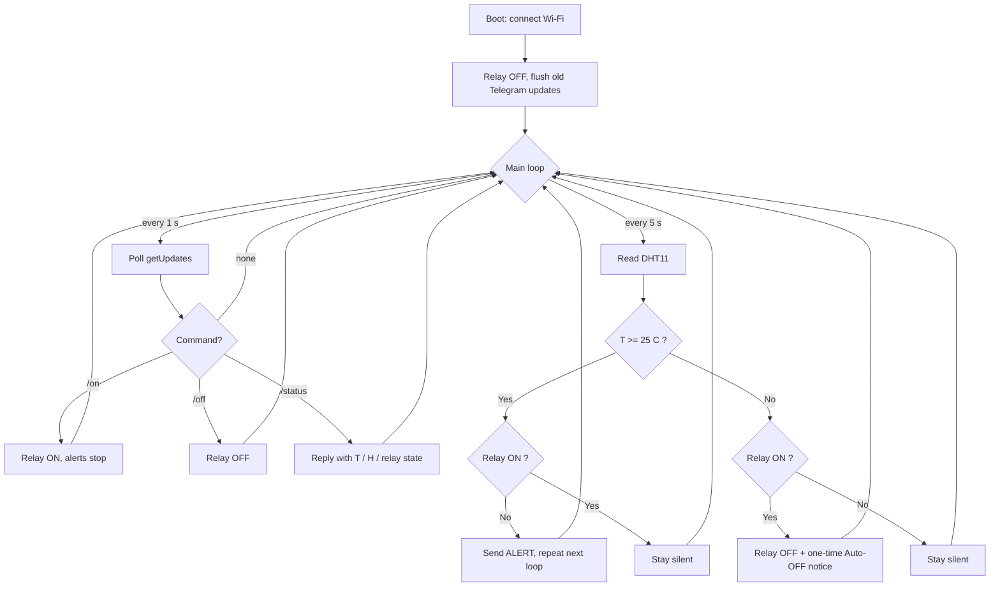

# LAB1 — Temperature Sensor with Relay Control (Telegram)

**Course:** IoT · **Group 3** · Repository: `Iot-Group3-Lab1`

A small IoT monitoring node built on an **ESP32** running **MicroPython**. The board samples a
temperature/humidity sensor every 5 seconds, sends **Telegram** alerts when the temperature reaches
the threshold, and lets anyone in the group chat drive the relay with `/on`, `/off` and `/status`.
When the temperature falls back below the threshold the relay is switched **off automatically** and a
one-time notice is posted to the chat.

The lab is built up in four stages — each one adds a capability to the previous — and every stage has
its own section below with its code, its behaviour, and the evidence it produced.

| Task | File | Adds | Evidence |
|---|---|---|---|
| [1](#task-1--sensor-read--print-10-pts) | `Task1.py` | Sensor reading + serial print | [screenshots](#evidence) |
| [2](#task-2--telegram-send-15-pts) | `Task2.py` | Wi-Fi + `send_message()` | [chat screenshot](#evidence-1) |
| [3](#task-3--bot-commands-15-pts) | `Task3.py` | `/status`, `/on`, `/off` | [chat screenshot](#evidence-2) |
| [4](#task-4--alerting--auto-off-30-pts) | `Task4.py` | Threshold alerts + auto-OFF state machine | [demo video](#evidence-3) |
| [5](#task-5--documentation-30-pts) | `README.md` | This document | — |

---

## Hardware & wiring

* ESP32 Dev Board (MicroPython firmware flashed)
* **DHT11** temperature / humidity sensor
* 1-channel relay module
* Jumper wires, USB cable
* Laptop with **Thonny**, plus Wi-Fi with internet access

> **Note on the lab sheet.** The handout specifies a **DHT22** on `D4` with the relay on `D2`. The
> parts available to us were a **DHT11**, and the pins were moved to free GPIOs, so the code as
> submitted uses the wiring below. The DHT11 driver (`dht.DHT11`) returns whole-degree integers
> rather than the DHT22 decimals, which is why the readings show no fractional part. To switch to a
> DHT22, change `dht.DHT11(...)` to `dht.DHT22(...)` and re-wire the data pin — nothing else in the
> logic needs to change.

| Module | Module pin | ESP32 pin |
|---|---|---|
| DHT11 | `+` / VCC | 5V (or 3V3) |
| DHT11 | `-` / GND | GND |
| DHT11 | `OUT` / DATA | **GPIO33** |
| Relay | VCC | 5V |
| Relay | GND | GND |
| Relay | IN | **GPIO2** (`Task3.py`) / **GPIO15** (`Task4.py`) |

```
        ESP32 DevKit                        DHT11
   +-------------------+              +---------------+
   |               5V  |--------------| +  (VCC)      |
   |               GND |--------------| -  (GND)      |
   |            GPIO33 |--------------| OUT (DATA)    |
   |                   |              +---------------+
   |                   |
   |                   |               Relay module
   |               5V  |--------------| VCC           |
   |               GND |--------------| GND           |
   |    GPIO2 / GPIO15 |--------------| IN            |
   +-------------------+              +---------------+
                                       NO / COM --> load
```

**Safety.** Keep the mains/load side of the relay isolated — do not touch the screw-terminal side
while it is energised, and drive only a low-voltage dummy load for the demo. The relay module is
powered from 5V while the ESP32 GPIO signal is 3.3V; the opto-isolated input on the module handles
the level difference.

---

## Configuration (needed from Task 2 onward)

Every network-facing script has a configuration block at the top. Fill it in before running.

```python
# ---------- WIFI ----------
SSID     = "Robotic WIFI"
PASSWORD = " "

# ---------- TELEGRAM ----------
BOT_TOKEN = " "      # <-- paste your bot token here
CHAT_ID   = " "      # <-- paste your group chat id here
```

> `BOT_TOKEN` and `CHAT_ID` are intentionally left **blank** in this repository — they are
> credentials and are not committed. Anyone running the code must supply their own.

**Getting a bot token**

1. Open Telegram and start a chat with **@BotFather**.
2. Send `/newbot`, then give the bot a name and a username ending in `bot`.
3. BotFather replies with a token of the form `123456789:AA...`. Copy it into `BOT_TOKEN`.

**Getting the chat id**

1. Create a group and add your bot to it (our group is `LapIoT`).
2. In BotFather, use `/setprivacy` → **Disable** so the bot can read plain group messages.
3. Send any message in the group, then open
   `https://api.telegram.org/bot<BOT_TOKEN>/getUpdates` in a browser and read
   `result[0].message.chat.id`. Group ids are negative (e.g. `-1001234567890`).
   Alternatively add **@IDBot** to the group and ask it for the id.
4. Copy the value into `CHAT_ID`.

**Running any task file**

1. Flash MicroPython onto the ESP32 and open **Thonny**
   (`Tools → Options → Interpreter → MicroPython (ESP32)`).
2. Open the task file, fill in the credentials, press **Run** (F5).
3. To start on power-up instead, save it to the board as `main.py`
   (`File → Save as… → MicroPython device → main.py`).

---

# Task 1 — Sensor Read & Print (10 pts)

**Requirement:** read the DHT sensor every 5 seconds and print temperature and humidity.

### What it does

`Task1.py` is the simplest possible version: no networking at all. It creates a `dht.DHT11` object on
**GPIO33**, then loops forever — call `measure()` to trigger a conversion, read back the two values,
print them, and sleep 5 seconds.

```python
sensor = dht.DHT11(Pin(33))

while True:
    try:
        sensor.measure()
        temperature = sensor.temperature()  # °C
        humidity    = sensor.humidity()     # %
        print("Temperature: {} °C".format(temperature))
        print("Humidity: {} %".format(humidity))
    except OSError:
        print("Failed to read from DHT11 sensor")
    time.sleep(5)
```

The `try`/`except OSError` matters: the DHT protocol is timing-sensitive and an occasional read fails.
Catching it means one bad sample prints a warning instead of killing the loop.

> **On the "2 decimals" requirement.** The lab asks for two decimal places, which assumes a DHT22.
> The DHT11 returns integers, so there are no decimals to print — `25` rather than `25.00`. Formatting
> with `"{:.2f}"` would only pad the value with two zeros and imply a precision the sensor doesn't
> have, so the raw integer is printed instead.

### Evidence

The code running in Thonny:



Serial output, one reading every 5 seconds:



The shell shows the expected steady stream — `Temperature: 25 °C`, `Humidity: 47 %` — with the value
ticking up to 26 °C as the sensor warms.

---

# Task 2 — Telegram Send (15 pts)

**Requirement:** implement `send_message()` and post a test message to the group.

### What it does

`Task2.py` adds the two things Task 1 lacked: a Wi-Fi connection and an HTTP call to the Telegram Bot
API. It brings up the station interface, blocks until the board has an IP, then posts to the
`sendMessage` endpoint once per loop.

```python
wifi = network.WLAN(network.STA_IF)
wifi.active(True)
wifi.connect(SSID, PASSWORD)
while not wifi.isconnected():
    time.sleep(1)

URL_SEND = "https://api.telegram.org/bot{}/sendMessage".format(BOT_TOKEN)

urequests.post(URL_SEND, json={
    "chat_id": CHAT_ID,
    "text": message
})
```

Sending is just an HTTP POST with a JSON body of `chat_id` and `text` — no Telegram library is
needed. This is the primitive every later task is built on.

### Evidence



`Hello from ESP32! Bot is online.` arriving in the `LapIoT` group confirms the token, chat id, and
Wi-Fi path all work. The temperature/humidity messages higher up the same chat are from an earlier
run that posted live readings.

---

# Task 3 — Bot Commands (15 pts)

**Requirement:** implement `/status` to reply with current T/H and relay state, and `/on` / `/off` to
control the relay.

### What it does

Task 2 could only talk. `Task3.py` makes the bot **listen**, which means polling the `getUpdates`
endpoint and tracking which messages have already been handled.

```python
last_update_id = 0

url = URL_UPDATES + "?offset={}".format(last_update_id + 1)
response = urequests.get(url)
data = response.json()
response.close()

for update in data["result"]:
    last_update_id = update["update_id"]
    ...
```

The `offset` parameter is the key idea: passing `last_update_id + 1` tells Telegram to only return
messages newer than the last one handled, so commands aren't processed twice.

The relay is on **GPIO2** here, initialised OFF, with `relay_state` tracking it in software so
`/status` can report it:

| Command | Action |
|---|---|
| `/status` | Replies with the latest temperature, humidity and relay state. |
| `/on` | `relay.value(1)`, sets `relay_state = True`, confirms in chat. |
| `/off` | `relay.value(0)`, sets `relay_state = False`, confirms in chat. |

### Evidence



All three commands in one exchange:

1. `/status` → `Temp: 26 C / Humidity: 43 % / Relay: OFF`
2. `/off` → `Relay turned OFF`
3. `/on` → `Relay turned ON`
4. `/status` again → `Relay: ON`, confirming the state actually changed and is reported back.

---

# Task 4 — Alerting & Auto-OFF (30 pts)

**Requirement:** silent below 25 °C; alert every loop while ≥ 25 °C with the relay OFF; stop alerting
after `/on`; automatically switch OFF with a one-time notice when the temperature drops back.

### What it does

This is the full application, and the structure changes to support it. The relay moves to **GPIO15**,
and the blocking `time.sleep(5)` is replaced with a non-blocking timer loop running two jobs at
different rates:

```python
LOOP_INTERVAL = 5     # sensor read + alert repeat
POLL_INTERVAL = 1     # Telegram command poll

while True:
    now = time.ticks_ms()
    if time.ticks_diff(now, last_poll) >= POLL_INTERVAL * 1000:
        last_poll = now
        check_telegram()
    if time.ticks_diff(now, last_read) >= LOOP_INTERVAL * 1000:
        last_read = now
        ...  # read sensor, decide whether to alert or auto-OFF
    time.sleep_ms(100)
```

Polling commands once per second while reading the sensor every five keeps `/on` responsive — with a
single 5-second sleep the bot could take a full cycle to notice the command.

Three other details worth pointing out:

* **`flush_old_updates()`** runs once at boot and walks `getUpdates` forward without acting on
  anything, so commands sent while the board was powered off aren't replayed on start-up.
* **Sender filtering** — `if str(msg["chat"]["id"]) != str(CHAT_ID): continue` — means a stranger who
  finds the bot cannot switch the relay.
* **`r.close()`** after every request. The ESP32 has very little RAM and leaked sockets will
  eventually crash the loop.

### The behaviour

* **T < 25 °C, relay OFF** — completely silent, no messages at all.
* **T ≥ 25 °C, relay OFF** — an alert is posted **every loop (5 s)** until someone sends `/on`.
* **After `/on`** — alerts stop; the bot stays quiet while the relay runs.
* **T drops below 25 °C with the relay ON** — the relay is switched OFF automatically and a
  **one-time** `Auto-OFF` notice is sent, returning the system to the silent state.

Because the alert is only sent when `relay_state` is `False`, turning the relay on is what silences
it — no separate "muted" flag is needed. Likewise the auto-OFF notice fires only on the transition
from ON to OFF, so it cannot repeat.

### State / loop flowchart



The same logic as a simple state machine:

| State | Condition to enter | Behaviour | Exit |
|---|---|---|---|
| **IDLE** | T < limit and relay OFF | Silent | T ≥ limit → ALERTING |
| **ALERTING** | T ≥ limit and relay OFF | Alert every 5 s | `/on` → COOLING |
| **COOLING** | Relay ON | Silent | T < limit → auto-OFF, back to IDLE |

### Tunable settings

| Constant | Default | Meaning |
|---|---|---|
| `TEMP_LIMIT` | `25` | Alert / auto-OFF threshold in °C. |
| `LOOP_INTERVAL` | `5` | Seconds between sensor reads and alert repeats. |
| `POLL_INTERVAL` | `1` | Seconds between `getUpdates` polls. |
| `RELAY_ACTIVE_LOW` | `False` | Set `True` if the relay module switches on when IN is LOW. |

### Evidence

Demo video: **[`task4_vid.zip`](task4_vid.zip)** (download and extract to play).

The recording walks through the full cycle: silence while the room is below the limit, repeating
alerts once the sensor is warmed past 25 °C, the alerts stopping the moment `/on` is sent, and then
the automatic switch-off with its single `Auto-OFF` notice as the sensor cools.

---

# Task 5 — Documentation (30 pts)

**Requirement:** a README with wiring diagram/photo, configuration steps (token, chat id), usage
instructions, and a block diagram or flowchart of the loop/state.

This document is that deliverable:

* **Wiring** — pin table and diagram in [Hardware & wiring](#hardware--wiring).
* **Configuration** — token and chat id steps in [Configuration](#configuration-needed-from-task-2-onward).
* **Usage** — running instructions above, and the command reference in [Task 3](#task-3--bot-commands-15-pts).
* **Flowchart** — the Mermaid diagram and state table in [Task 4](#state--loop-flowchart).
* **Evidence** — screenshots embedded in each task section, video linked in Task 4.

> **Outstanding:** the submission checklist also asks for a **photo of the physical wiring**. The repo
> currently has the pin table and ASCII diagram but no photograph of the assembled breadboard. Add
> one (e.g. `wiring.jpg`) and reference it in the wiring section to close that gap.

---

## Notes, limits and reflection

* **Sampling rate.** 5 s matches the lab requirement and is well within the DHT11 minimum conversion
  time of about 1 s. Commands are polled once per second so `/on` feels responsive without reading
  the sensor faster than it can respond.
* **Telegram rate limits.** Alerting every 5 s while over the threshold is roughly 12 messages per
  minute — under the ~20 messages/minute limit Telegram applies to a group, but close enough that a
  longer interval or exponential back-off would be safer in a real deployment.
* **Reliability.** Every network call is wrapped in `try`/`except` so a dropped request logs an error
  instead of crashing the loop, and each response is closed to avoid exhausting the ESP32's limited
  memory. Wi-Fi is not re-checked after the initial connection — an automatic reconnect would be the
  first improvement to make.
* **DHT11 resolution.** The DHT11 reports whole degrees, so readings sit exactly on the 25 °C
  boundary fairly often. A hysteresis band (alert at ≥ 25 °C, auto-OFF at ≤ 23 °C) would stop the
  state machine from flapping around the threshold.
* **Security / ethics.** The bot only accepts commands from the configured `CHAT_ID`, so a stranger
  who finds the bot cannot switch the relay. The token is a full credential — anyone holding it can
  control the hardware — which is why it is kept out of this repository and why the repo is private.
  A device that can energise a physical load from a chat message should always be reviewed for what
  happens if it is left ON, or if the network drops mid-cycle.
