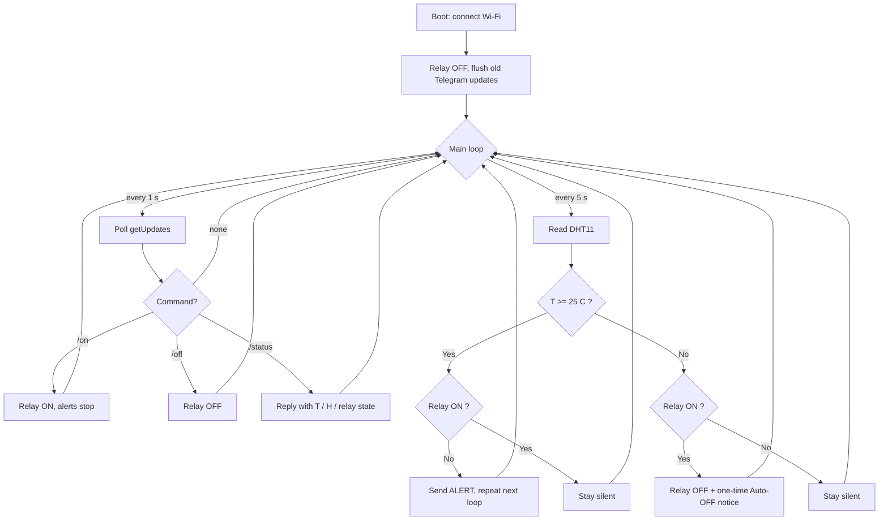

# LAB1 — Temperature Sensor with Relay Control (Telegram)

**Course:** IoT · **Group 3** · Repository: `Iot-Group3-Lab1`

A small IoT monitoring node built on an **ESP32** running **MicroPython**. The board samples a
temperature/humidity sensor every 5 seconds, sends **Telegram** alerts when the temperature reaches
the threshold, and lets anyone in the group chat drive the relay with `/on`, `/off` and `/status`.
When the temperature falls back below the threshold the relay is switched **off automatically** and a
one-time notice is posted to the chat.

---

## 1. Contents

| File | Task | What it does |
|---|---|---|
| `Task1.py` | Task 1 | Reads the DHT sensor every 5 s and prints temperature + humidity to the serial console. |
| `Task2.py` | Task 2 | Connects to Wi-Fi and posts a test message to the Telegram group via `sendMessage`. |
| `Task3.py` | Task 3 | Adds `getUpdates` polling and the `/status`, `/on`, `/off` commands. |
| `Task4.py` | Task 4 | Full state machine: threshold alerts, alert suppression after `/on`, and automatic cool-down OFF. |
| `task1_pic1.png`, `task1_pic2.png` | Task 1 evidence | Thonny editor + serial shell output of the sensor readings. |
| `task2_pic.jpg` | Task 2 evidence | Telegram chat showing `Hello from ESP32! Bot is online.` |
| `Task3_pic.jpg` | Task 3 evidence | Telegram chat showing `/status`, `/on` and `/off` all replying correctly. |
| `task4_vid.zip` | Task 4 evidence | Demo video of the alert → `/on` → cool-down → auto-OFF cycle. |

---

## 2. Hardware

* ESP32 Dev Board (MicroPython firmware flashed)
* **DHT11** temperature / humidity sensor
* 1-channel relay module
* Jumper wires, USB cable
* Laptop with **Thonny**, plus Wi-Fi with internet access

> **Note on the lab sheet.** The lab handout specifies a **DHT22** on `D4` with the relay on `D2`.
> The parts available to us were a **DHT11**, and the pins were moved to free GPIOs, so the code as
> submitted uses the wiring in the table below. The DHT11 driver (`dht.DHT11`) returns whole-degree
> integers rather than the DHT22 decimals, which is why the printed values show no fractional part.
> To switch to a DHT22, change `dht.DHT11(...)` to `dht.DHT22(...)` and re-wire the data pin — nothing
> else in the logic needs to change.

### Wiring (as built)

| Module | Module pin | ESP32 pin |
|---|---|---|
| DHT11 | `+` / VCC | 5V (or 3V3) |
| DHT11 | `-` / GND | GND |
| DHT11 | `OUT` / DATA | **GPIO33** |
| Relay | VCC | 5V |
| Relay | GND | GND |
| Relay | IN | **GPIO2** (`Task3.py`) / **GPIO15** (`Task4.py`) |

```
        ESP32 DevKit                        DHT11
   +-------------------+              +---------------+
   |               5V  |--------------| +  (VCC)      |
   |               GND |--------------| -  (GND)      |
   |            GPIO33 |--------------| OUT (DATA)    |
   |                   |              +---------------+
   |                   |
   |                   |               Relay module
   |               5V  |--------------| VCC           |
   |               GND |--------------| GND           |
   |    GPIO2 / GPIO15 |--------------| IN            |
   +-------------------+              +---------------+
                                       NO / COM --> load
```

**Safety.** Keep the mains/load side of the relay isolated — do not touch the screw-terminal side
while it is energised, and drive only a low-voltage dummy load for the demo. The relay module is
powered from 5V while the ESP32 GPIO signal is 3.3V; the opto-isolated input on the module handles
the level difference.

---

## 3. Configuration

Every network-facing script has a configuration block at the top. Fill it in before running.

```python
# ---------- WIFI ----------
SSID     = "Robotic WIFI"
PASSWORD = " "

# ---------- TELEGRAM ----------
BOT_TOKEN = " "      # <-- paste your bot token here
CHAT_ID   = " "      # <-- paste your group chat id here
```

> The `BOT_TOKEN` and `CHAT_ID` are intentionally left **blank** in this repository — they are
> credentials and are not committed. Anyone running the code must supply their own.

### 3.1 Getting a bot token

1. Open Telegram and start a chat with **@BotFather**.
2. Send `/newbot`, then give the bot a name and a username ending in `bot`.
3. BotFather replies with a token of the form `123456789:AA...`. Copy it into `BOT_TOKEN`.

### 3.2 Getting the chat id

1. Create a group and add your bot to it (our group is `LapIoT`).
2. In BotFather, use `/setprivacy` → **Disable** for your bot so it can read plain group messages.
3. Send any message in the group, then open
   `https://api.telegram.org/bot<BOT_TOKEN>/getUpdates` in a browser and read
   `result[0].message.chat.id`. Group ids are negative (e.g. `-1001234567890`).
   Alternatively add **@IDBot** to the group and ask it for the id.
4. Copy the value into `CHAT_ID`.

### 3.3 Tunable settings (`Task4.py`)

| Constant | Default | Meaning |
|---|---|---|
| `TEMP_LIMIT` | `25` | Alert / auto-OFF threshold in °C. |
| `LOOP_INTERVAL` | `5` | Seconds between sensor reads and alert repeats. |
| `POLL_INTERVAL` | `1` | Seconds between `getUpdates` polls, so `/on` reacts quickly. |
| `RELAY_ACTIVE_LOW` | `False` | Set to `True` if your relay module turns on when the IN pin is LOW. |

---

## 4. Running

1. Flash MicroPython onto the ESP32 and open **Thonny** (`Tools → Options → Interpreter → MicroPython (ESP32)`).
2. Open the task file you want to run, fill in `BOT_TOKEN` and `CHAT_ID`.
3. Press **Run** (F5). The shell prints `Connecting to WiFi...` then `WiFi connected`.
4. To have it start on power-up instead, save the file to the board as `main.py`
   (`File → Save as… → MicroPython device → main.py`).

### Bot commands

| Command | Reply |
|---|---|
| `/status` | Current relay state, temperature, humidity and the configured limit. |
| `/on` | Turns the relay ON and stops the repeating alerts. |
| `/off` | Turns the relay OFF. |
| `/start`, `/help` | Lists the available commands. |

Any other text gets `Unknown command. Send /on, /off or /status`. Messages from chats other than the
configured `CHAT_ID` are ignored, and updates that arrived while the board was powered off are
flushed at start-up so the bot does not replay old commands.

---

## 5. Alerting behaviour (Task 4)

* **T < 25 °C, relay OFF** — completely silent, no messages at all.
* **T ≥ 25 °C, relay OFF** — an alert is posted **every loop (5 s)** until someone sends `/on`.
* **After `/on`** — alerts stop; the bot stays quiet while the relay runs.
* **T drops below 25 °C with the relay ON** — the relay is switched OFF automatically and a
  **one-time** `Auto-OFF` notice is sent. The system is then back in the silent state.

### State / loop flowchart



The same logic as a simple state machine:

| State | Condition to enter | Behaviour | Exit |
|---|---|---|---|
| **IDLE** | T < limit and relay OFF | Silent | T ≥ limit → ALERTING |
| **ALERTING** | T ≥ limit and relay OFF | Alert every 5 s | `/on` → COOLING |
| **COOLING** | Relay ON | Silent | T < limit → auto-OFF, back to IDLE |

---

## 6. Test evidence

| Task | Evidence | Shows |
|---|---|---|
| 1 | `task1_pic1.png`, `task1_pic2.png` | Serial output — `Temperature: 25 °C`, `Humidity: 47 %`, repeating every 5 s. |
| 2 | `task2_pic.jpg` | `Hello from ESP32! Bot is online.` delivered to the `LapIoT` group. |
| 3 | `Task3_pic.jpg` | `/status` → `Temp: 26 C / Humidity: 43 % / Relay: OFF`, then `/on` → `Relay turned ON`, `/status` → `Relay: ON`, `/off` → `Relay turned OFF`. |
| 4 | `task4_vid.zip` | Video of silence below the limit, repeating alerts above it, alerts stopping after `/on`, and the automatic OFF with its one-time notice on cool-down. |

---

## 7. Notes, limits and reflection

* **Sampling rate.** 5 s matches the lab requirement and is well within the DHT11 minimum
  conversion time of about 1 s. Commands are polled once per second so `/on` feels responsive
  without the sensor being read faster than it can respond.
* **Telegram rate limits.** Alerting every 5 s while over the threshold is roughly 12 messages per
  minute — under the ~20 messages/minute limit Telegram applies to a group, but close enough that a
  longer interval or exponential back-off would be safer in a real deployment.
* **Reliability.** Every network call is wrapped in `try/except` so a dropped request logs an error
  instead of crashing the loop, and each response is closed with `.close()` to avoid exhausting the
  limited memory on the ESP32. Wi-Fi is not currently re-checked after the initial connection — an
  automatic reconnect would be the first improvement to make.
* **DHT11 resolution.** The DHT11 reports whole degrees, so readings sit exactly on the 25 °C
  boundary fairly often. A hysteresis band (e.g. alert at ≥ 25 °C, auto-OFF at ≤ 23 °C) would stop
  the state machine from flapping around the threshold.
* **Security / ethics.** The bot only accepts commands from the configured `CHAT_ID`, so a stranger
  who finds the bot cannot switch the relay. The token is a full credential — anyone holding it can
  control the hardware — which is why it is kept out of this repository and why the repo is private.
  A device that can energise a physical load from a chat message should always be reviewed for what
  happens if it is left ON, or if the network drops mid-cycle.
